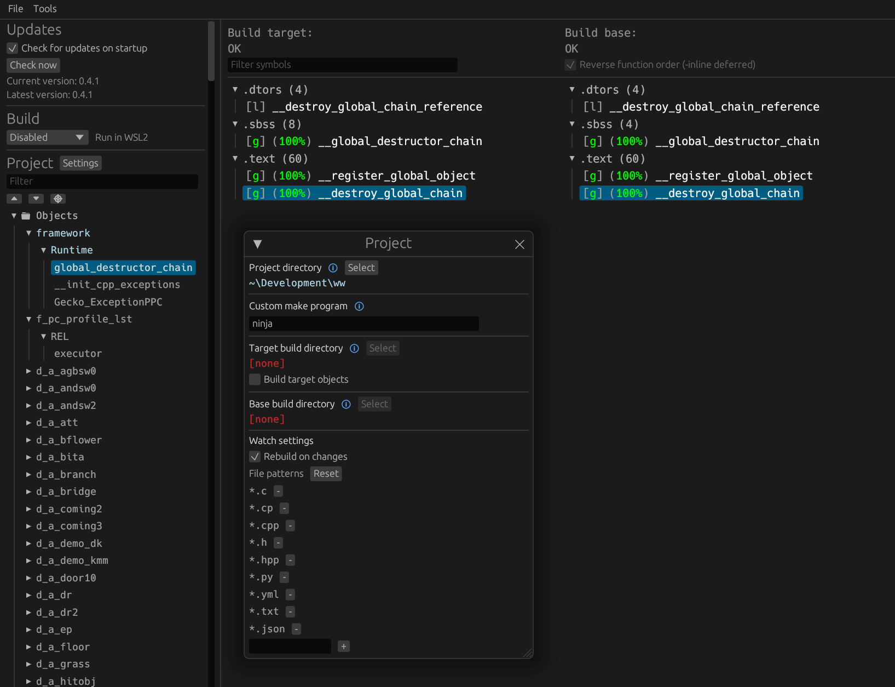

Spyro: A Hero's Tail
=============

A work-in-progress decompilation of the **GameCube**  and **PS2** versions of Spyro: A Hero's Tail.

This repository does **not** contain any game assets or assembly whatsoever. An existing copy of the game is required.

Supported versions:

- `G5SE7D`: (NTSC)
- `PS2`: (Pal PS2 Release)

# Dependencies

## Windows

On Windows, it's **highly recommended** to use native tooling. WSL or msys2 are **not** required.  
When running under WSL, [objdiff](#diffing) is unable to get filesystem notifications for automatic rebuilds.

- Install [Python](https://www.python.org/downloads/) and add it to `%PATH%`.
  - Also available from the [Windows Store](https://apps.microsoft.com/store/detail/python-311/9NRWMJP3717K).
- Download [ninja](https://github.com/ninja-build/ninja/releases) and add it to `%PATH%`.
  - Quick install via pip: `pip install ninja`

## macOS

- Install [ninja](https://github.com/ninja-build/ninja/wiki/Pre-built-Ninja-packages):

  ```sh
  brew install ninja
  ```

[wibo](https://github.com/decompals/wibo), a minimal 32-bit Windows binary wrapper, will be automatically downloaded and used.

## Linux

- Install [ninja](https://github.com/ninja-build/ninja/wiki/Pre-built-Ninja-packages).

[wibo](https://github.com/decompals/wibo), a minimal 32-bit Windows binary wrapper, will be automatically downloaded and used.

# Building

  - Clone the repository:
  ```sh
  git clone https://github.com/LivewireCB/Hero-s-Tail-Decomp.git
  ```

  ## Gamecube

  - Configure:

  ```sh
    python configure.py
  ```

  - Build:

  ```sh
    ninja
  ```

  - Extract `Spyro.ELF`, copy it into `orig/G5SE7D`, and convert it into a DOL using the following command:

  ```sh
    ./build/tools/dtk elf2dol ./orig/G5SE7D/Spyro.ELF ./orig/G5SE7D/sys/main.dol
  ```

  - Build:

  ```sh
    ninja
  ```

  ## PS2

  - Install Prerequisites:
  ```sh
    pip install -r requirements.txt
  ```


  - Configure:

  ```sh
    python configure.py -v PS2
  ```


  - Extract `SLES525.69`, and copy it into `orig/PS2`


  - Build:

  ```sh
    ninja
  ```

# Dual Configure System

The ability to switch between the GC and PS2 versions is extremely new, Any bugs have not been caught yet.
If you were to run into a bug, most times it can be solved by deleting the *build* folder and the *.splache*

Bare with me as I work out the kinks of this system.

# Diffing

Once the initial build succeeds, an `objdiff.json` should exist in the project root.

Download the latest release from [encounter/objdiff](https://github.com/encounter/objdiff). Under project settings, set `Project directory`. The configuration should be loaded automatically.

Select an object from the left sidebar to begin diffing. Changes to the project will rebuild automatically: changes to source files, headers, `configure.py`, `splits.txt` or `symbols.txt`.


